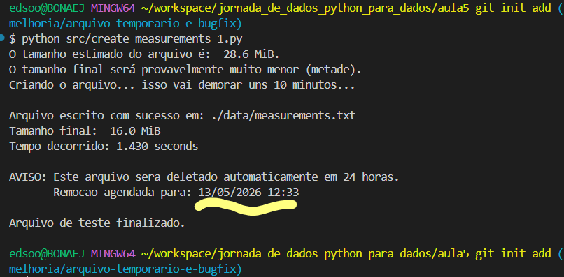

# Melhorias Implementadas

## 1. Bug Fix — `next` → `continue`

Corrigido bug em `build_weather_station_name_list()` onde `next` era usado como
statement mas não fazia nada em Python. Estações com `#` no nome eram
incorretamente incluídas na lista.

**Antes:**
```python
if "#" in station:
    next
```

**Depois:**
```python
if "#" in station:
    continue
```

## 2. Deleção Automática do arquivo de medições após 24h

O arquivo `measurements.txt` pode ocupar até ~14GB para 1 bilhão de linhas.
Sem boas práticas de limpeza, cada execução acumula espaço desnecessário.

**Solução implementada em `create_measurements_1.py`:**
- Arquivo gerado normalmente em `data/measurements.txt`
- Aviso exibido com data e hora de expiração
- Após 24h, arquivo deletado automaticamente na próxima execução


